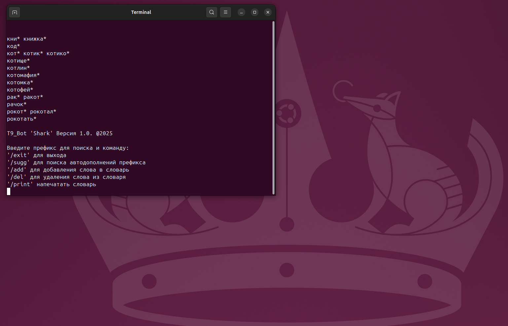
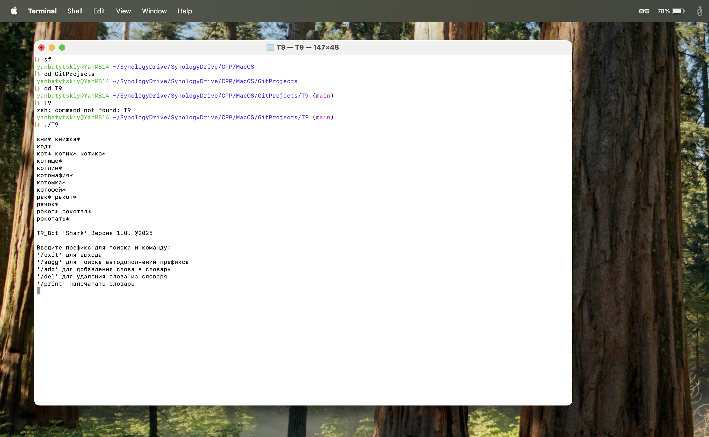
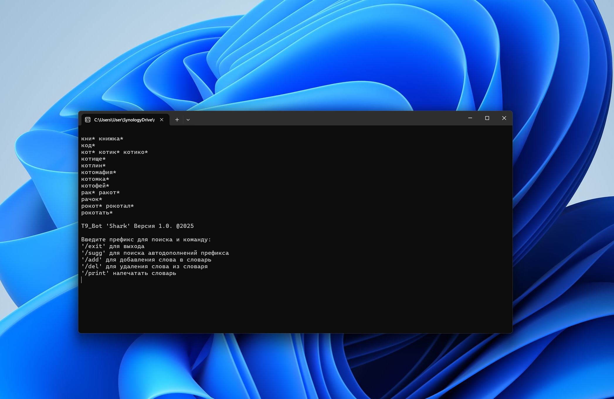

# 💬 T9_Bot SHARK v 1.0 2025 made by Yan Batytskiy

**T9_tBot** — это консольная система поиска и автодополнения ввода на C++17, поддерживающая добавление и удаление слов, поиск по префиксу, вывод только пяти первых значений и всех вариантов автодополнения. Проект построен на модульной кроссплатформенной архитектуре (Linux/Windows/MacOS) для использования на русском языке с поддержкой UTF-8, а также с использованием пользовательских исключений и `CMake`.

---

## 🧱 Структура проекта

```
T9_Bot/
├── CMakeLists.txt
├── build/          # генерируется автоматически
└── README.md
```
## ⚙️ Требования

- C++17-совместимый компилятор (`g++`, `clang++`, `MSVC`)
- `CMake` версии **3.16+**
- (рекомендуется) `clangd` для автодополнения и анализа

---

## 🛠️ Сборка и запуск

### 🔧 1. Конфигурация проекта
```bash
cmake -S . -B build
```

### 🧪 2. Сборка
```bash
cmake --build build
```

### 🚀 3. Запуск
```bash
./build/T9
```
### 🚀 4. Кроссплатформенность
### Linux

### MacOS

### Windows


---

## 📚 Лицензия

MIT License
